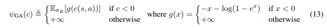
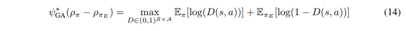

# GAIL
### Generative Adversarial Imitation Learning 
논문 링크 : [LINK](https://arxiv.org/abs/1606.03476)


## Introduction
### ```Inverse Reinforcement Learning(IRL)```
- Expert로부터 Trajectory Sample로 Cost function을 학습하는 방법 
- 단점으로는 learner가 어떻게 행동해야하는지에 대해서 직접적으로 알려주지 않음.
- Cost Function을 통해 간접적으로 Task를 학습하기 때문에 이 방식은 필연적으로 학습이 느릴 수 밖에 없음.
- 해당 논문의 저자는 GAN을 이용하여 중간과정인 IRL step을 생략하고 데이터를 통해 policfy를 직접적으로 학습하는 방법을 소개함(model-free imitation learning)


## Background
주어진 Expert Policy $`\pi_{E}`$에 대해 Inverse Reinforcement Learning문제는 다음과 같이 정의할 수 있음

$`\max_{c \in \mathcal{C}}(\min_{\pi \in \Pi}\; -H(\pi) + \mathbb{E}_{\pi}[c(s,a)]) - \mathbb{E}_{\pi_{E}}[(s,a)]`$

where $`H(\pi) \triangleq \mathbb{E}_{\pi}[-\log \pi(a|s)]`$ is the $`\gamma`$- discounted casual entropy of the policy $`\pi`$.\
또한 Cost를 최소화 하는 `high-entropy policy`는 다음과 같이 정의한다.

$RL(c) = arg \min_{\pi \in \Pi} -H(\pi) + \mathbb{E}_{\pi}[c(s,a)]$

수식을 해석보자면, Policy $\pi$에 대한 Entropy는 높히고, Cost의 값을 최소로 하는 Optimal을 찾는 과정이다.


## Characterizing the induced optimal policy 
IRL은 결과적으로 expert policy가 다른 모든 policy들보다 낮은 cost를 발생하도록 하는 cost function을 찾는 것과도 같다.

$`IRL_\psi = arg \max_{c \in \mathbb{R}^{S \times A}} -\psi(c) + (\min_{\pi \in \Pi} -H(\pi) + \mathbb{E}_{\pi}[c(s,a)])- \mathbb{E}_{\pi_{E}}[c(s,a)],`$
where $\psi$ is a cost regularizer.

여기서 관심있어 봐야할 부분은 RL($`\tilde{c}`$)로 얻어지는 policy다. ($`\tilde{c}`$는 IRL의 결과)
Policy $`\pi$에 대한 occupancy measure($\rho$)가 $rho_{\pi} : \mathcal{S \times A} \rightarrow \mathbb{R}\; \mathbf{as\; \rho_{\pi}(s,a = \pi(a|s) \sum^{\infty}_{t=1} \gamma^t P(s_t = s |\pi))}`$이고,

이고, 임의의 cost function $c$에 대해서 $`\mathbb{E}_\pi[c(s,a)] = \sum_{s,a}\rho_\pi(s,a)c(s,a)`$일 때, 이를 RL과 IRL의 합성함수로 나타내어 보자.


$`RL \circ IRL_\psi (\pi_E)  = arg\min_{\pi \in \Pi} \: \max_{c \in \mathbb{R}^{S \times A}} - H(\pi) + \mathbb{E}_{\pi}[c(s,a)] - \mathbb{E}_{\pi_E}[c(s,a)] -\psi(c)`$

$`= arg\min_{\pi \in \Pi} \: \max_{c \in \mathbb{R}^{S \times A}} - H(\pi) + \sum_{s,a} \rho_\pi (s, a) c(s,a) - \sum_{s,a} \rho_{\pi_E} (s, a) c(s,a) -\psi(c)`$

$`= arg\min_{\pi \in \Pi} \: \max_{c \in \mathbb{R}^{S \times A}} - H(\pi) + \sum_{s,a} \big( \rho_\pi (s, a) - \rho_{\pi_E} (s, a) \big) c(s,a) -\psi(c)`$

$`= arg\min_{\pi \in \Pi} -H(\pi) + \psi^* (\rho_\pi - \rho_{\pi_E}),`$

$`\text{where } \psi^* \text{ is a conjugate function}.`$


- Conjugate function: $f^{\ast}(x) = \sup_{y \in \mathbb{R}^{\mathcal{S \times A}}}x^Ty - f(y)$

위 문제를 다르게 말하면 $\psi^\ast$에 의한 ($\pi$ 와 $\pi_{E}$의) occpncy measure간의 차이가 최대한 작게끔 하는 것이다.$\\$
여기서 $\psi$ 함수가 Constant Function 이라면 위 문제는 두개의 변수에 대한 최적화문제입니다.( 라그랑지 승수법으로도 해결 가능) 

$\min_{\pi \in \Pi} -H(\pi)\; \text{subject to } \rho(s,a)= \rho_{E}(s,a)\quad \forall{s} \in \mathcal{S} , a \in \mathcal{A}.$\
즉, IRL은 occupancy measure가 expert의 것과 일치하는 policy를 찾아내는 과정이라고 볼 수 있다.

```
만약 ρ ∈ D면,ρ는 π_ρ(a|s)≜ρ(s,a)/∑a′ρ(s,a′)에 대한 occupancy measure이고, 
π_ρ는 occupancy measure ρ와 상응하는 유일한 policy다
 
- 해당 의미는 occupancy measure(ρ)가 특정 policy π에 대한 것이라면, 각 state-action pair의 발생확률은 해당 policy에 따라 결정됌.
즉 policy π에 의해 정의된 확률 분포인 π(a|s)를 이용하여 다음과 같이 표현이 가능하다.
ρ(s,a) = π(a|s)

주어진 occupancy measure에는 정확히 하나의 policy가 존재하며, 그 반대도 성립
```

## Practical occupancy Measure Matching 
위의 목차에서 유도한 최적화 문제는 다음과 같은 이유로 실용적이라고 보기 어려움
- 제한된 수의 Expert Trajectories만이 제공됌
- 아주 큰 환경에 대해서는 문제가 Intractable해진다. 가령 Constraint의 개수가 매우 많아진다.$\text{See) } \mathcal{S, A}$

문제를 Large Environment에 적합하게 만들기 위해 위에서 유도한 문제를 relax 해보자

$`\min_{\pi}d_{\psi}(\rho_\pi,\rho_{E}) - H(\pi)\quad \dots (1)`$  

$`\min_{\pi \in \Pi} -H(\pi)\; \text{subject to } \rho(s,a)= \rho_{E}(s,a)\quad \forall{s} \in \mathcal{S} , a \in \mathcal{A}.`$ 

이식에서 실제로는 두 Occupancy Measure이 완전히 같을 수 없기 때문에 위의 식을 식(1)로 변형한다.

여기서 $`d_{\psi}(\rho_{\pi},\rho_{E})`$는 occupancy measure가 다를수록 smoothly penalize시키는 함수이다.

### Entropy-regularized apprenticeship learning
Apprenticeship Learning via Inverse Reinforcement Learning(이하 APP)에서는 IRL문제를 다음과 같이 정의하였다.

$`\min_{\pi} \max_{c \in \mathcal{C}} \mathbb{E}_{\pi}[c(s,a)] - \mathbb{E}_{\pi_{E}}[c(s,a)]`$

위 식의 안쪽 max 함수를 변형해보면,

$`\max_{c \in \mathcal{C}} \mathbb{E}_{\pi}[c(s,a)] - \mathbb{E}_{\pi_{E}}[c(s,a)]`$ = $`\max_{c\in \ \mathbb{R}^{\mathcal{S \times A}}} -\delta_{\mathcal{C}}(c) + \sum_{s,a}(\rho_{\pi}(s,a) - \rho_{\pi_E}(s,a))c(s,a)$ =$\delta^{\ast}_{\mathcal{C}}(\rho_{\pi} - \rho_{\pi_E})`$

$`d_\psi(\rho_\pi, \rho_E) = \delta^{\ast}_{\mathcal{C}}(\rho_{\pi} - \rho_{\pi_E})`$ 로 둔다면, relaxed problem은 다음과 같아진다.

$`\min_{\pi} - H(\pi) + \max_{c \in \mathcal{C}}\mathbb{E}_{\pi}[c(s,a)] - \mathbb{E}_{\pi_E}[c(s,a)]`$

하지만, 위의 Canonical Method은  basis function $f_1,\dots,f_d$가 아주 잘 디자인이 되어있지 않은한, expert behaviour를 잘 설명하리라고 볼 수 없다.

이 방법을 large state, action space에 대한 policy function Aprroximation과 더 효과적인 Regularizer $\psi$를 GAN를 통해 통해 확장해보도록 하자.


## Generative Adversarial Imitation Learning 
좀 더 새로운 occupancy measure matching를 가능하게 하며 Large environment에서도 계산적으로 유효한 새로운 cost regularizer를 다음과 같이 정의 한다.

<p align='left'>
    
</p>

위의 Regularizer는 Cost function이 Expert State-Action Pair($`\pi(s,a)`$)에 대해 낮은 cost를 예측하면 penalty를 적게 발생시키고, 반대의 상황에서는 아주 큰 Penalty를 발생시키는데, 즉 Learner가 Expert의 $`\rho`$와의 차이가 적게난다면, 적은 penalty를 주고, 값이 크게 차이난다면 큰 penalty를 부여한다.

또한 모든 expert data에 대해 평균을 취하므로 Arbitrary expert datasets에 대한 어느정도의 조정이 가능할 것이다.

여기서 Conjugate Function $`\psi^{\ast}_{GA}`$는 Jensen-Shannon Divergence $`D_{JS}`$의 정의로부터 아래와 같이 정리된다.
<p align='left'>

</p>
